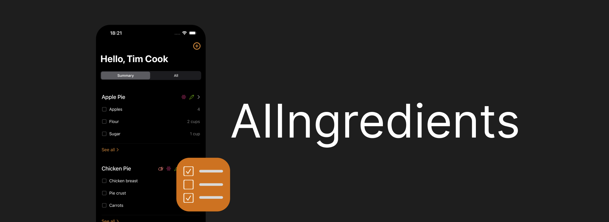

**AIIngredientes** is an innovative app that leverages Artificial Intelligence (AI) to enhance your culinary experience. Simplifies meal planning and shopping effortlessly with these key features:

- **AI-Powered Ingredient Lists**: Instantly generates ingredient lists along with their quantities based on a given meal.
- **Customizable Dietary Preferences**: Users can tailor their food preferences to include gluten-free, lactose-free, vegan, and vegetarian options.
- **Editable Shopping Lists**: The generated list doubles as an editable to-do list, which can be used as a shopping list for grocery purchases.

    

## Installation

To successfully run the application on your device, follow these steps:

1. Clone this project to your local machine.
2. Paste the `OpenAI-API-Key.plist` provided at `/Capstone` folder:

    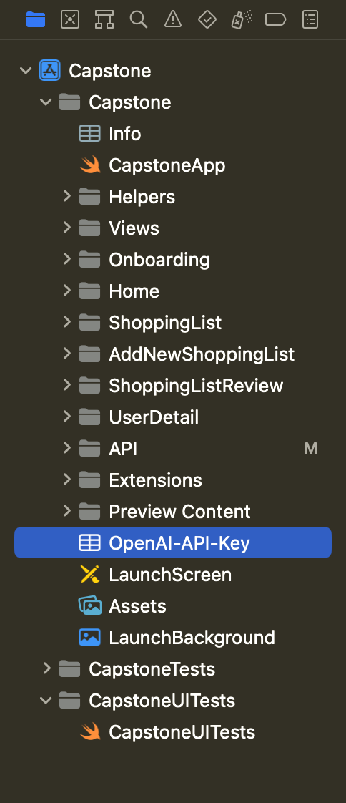

3. Build and run the application in Xcode

## Features

### Onboarding

Consists of three screens explaining app features that utilize **SwiftUI animations** such as `scaleEffect`, `opacity`, `linear`, `rotationEffect`, `speed`, `easeInOut`, and `repeatForever` animations. Following these screens, users encounter the user name and preferences screens.

The onboarding experience adapts based on user progression:

- **First-Time Users**: Initially presented with the three explanatory screens. The 'Start' button skips the explanatory screens and directs users to add their names.

| Step 1 | Step 2 | Step 3 |
| - | - | - |
| 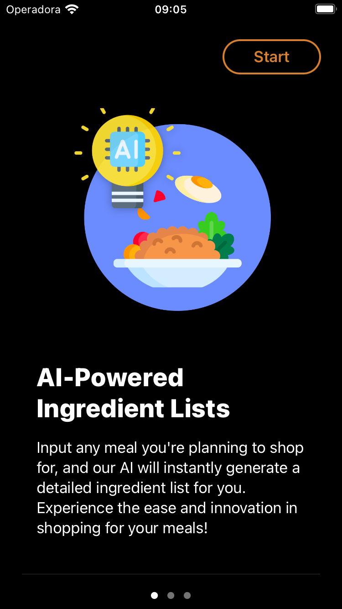 | 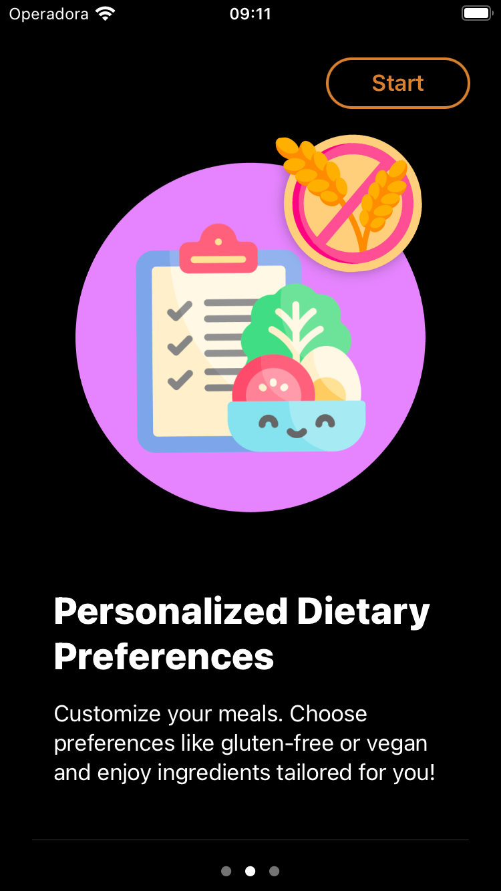 | 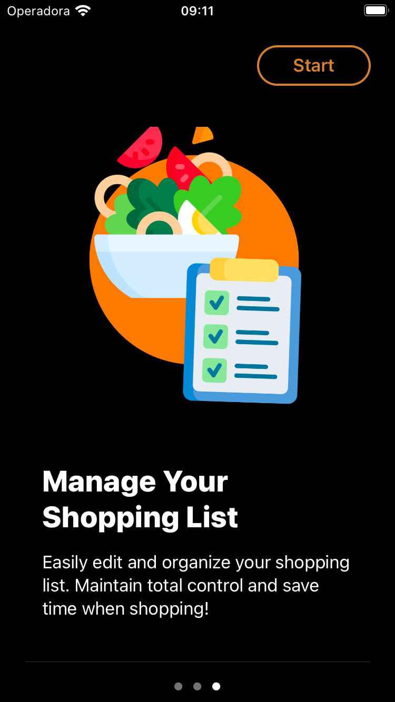 | 

- **Returning Users** (Post Feature Introduction): On subsequent app launches, users who have viewed the feature screens but haven't submitted their name will be directed straight to the name submission view.

    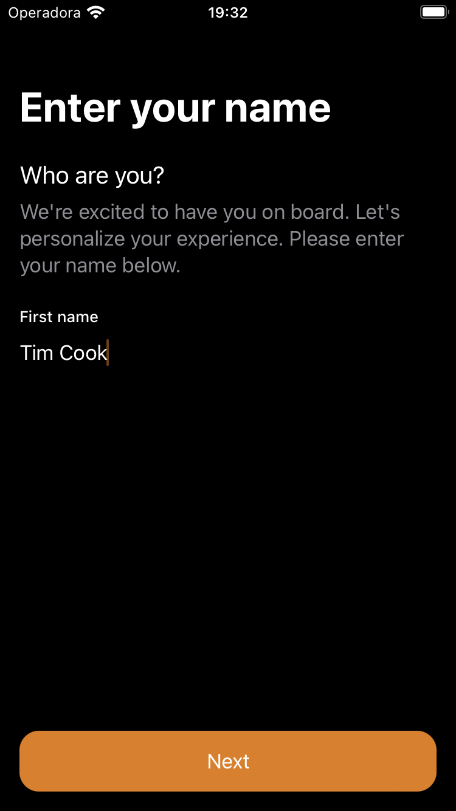

- **After Name Submission:** Once a name is submitted, returning users are taken directly to the dietary preferences setup on their next visit.

    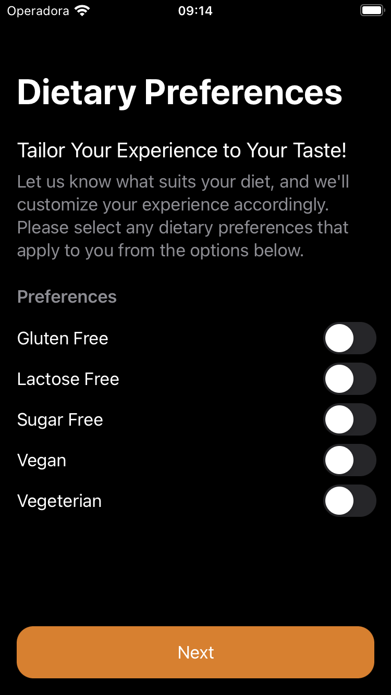

- **Post Dietary Preference Setup:** Users who have completed both their name submission and dietary preference setup will be greeted with the home screen upon opening the app thereafter, streamlining their experience.

### Home

Features **two tabs**: Shopping List and User Details

#### Shopping List

Shows compact (top 3 ingredients) or expanded **list** of ingredients for each meal. Users can strike off purchased items with **animation**. **Each meal has images** based on **dynamic information** regarding the food categories **delivered by the API.** Includes a button to add new recipes. The '**see more**' option in the compact view **navigates** to the meal detail view, which contains all the ingredients and quantities for the meal. 

| Summary | All |
| - | - |
| 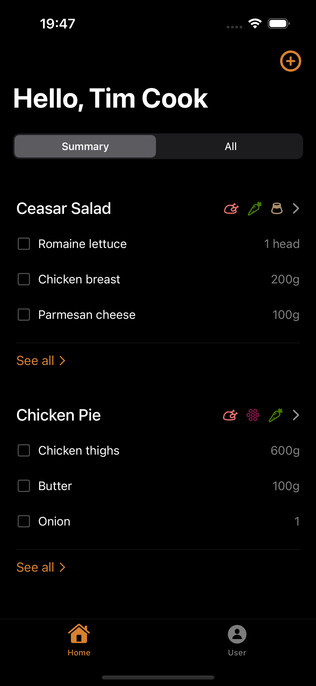 | 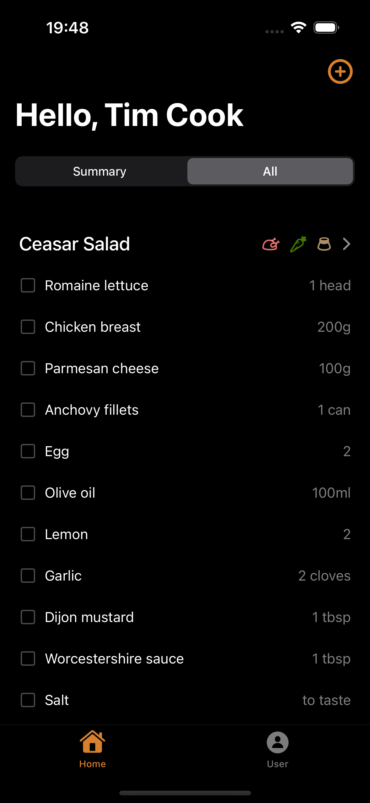 |

##### Empty View

It appears when no meals are added, with an option to add a new recipe.

    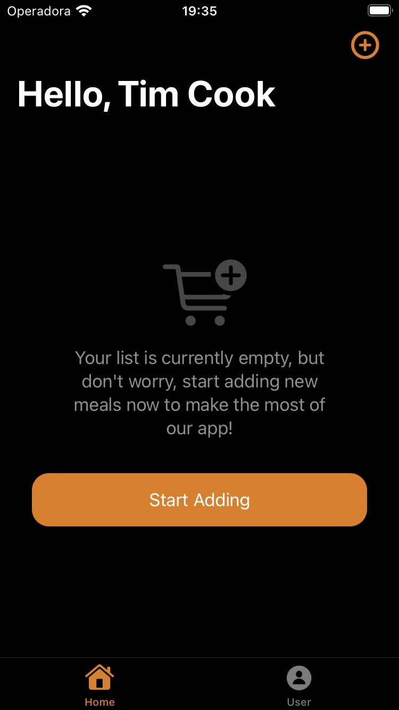

#### User Details

Displays saved user information, including name and dietary preferences set during onboarding.

    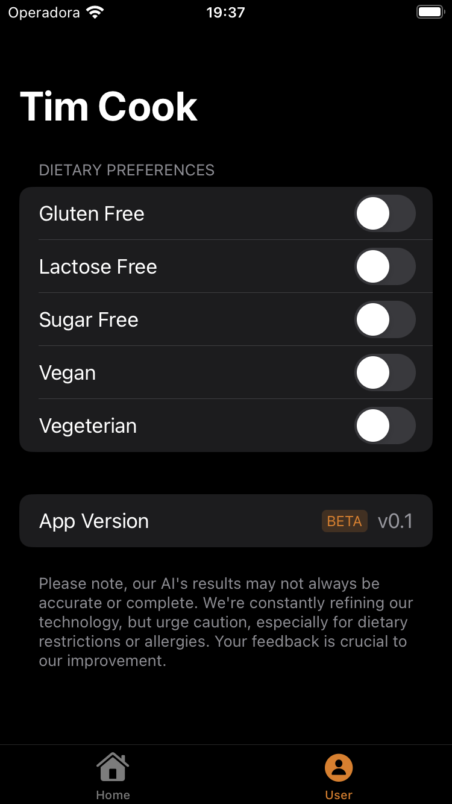

### Detail View

- Details all ingredients and quantities for a meal in a **list**, displaying food categories the meal may contain. Users can edit or delete items; a 'trash' icon enables meal deletion with a **confirmation prompt** for safety. Edits are made using a 'pen' icon and saved by clicking 'Done'. An **alert** is presented when the user attempts to delete all ingredients.

| Edit mode inactive | Edit mode active | Selection | Alert |
| - | - | - | - |
|  | 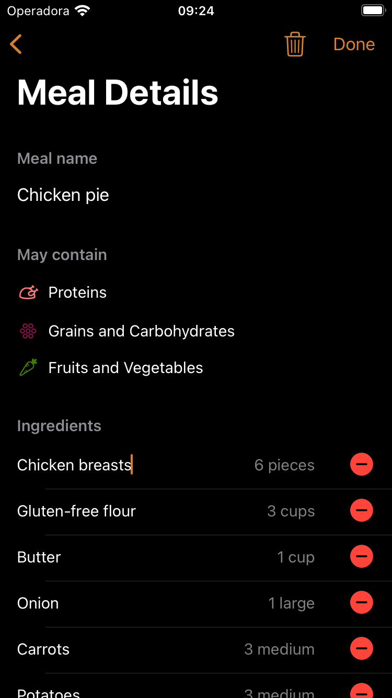 | 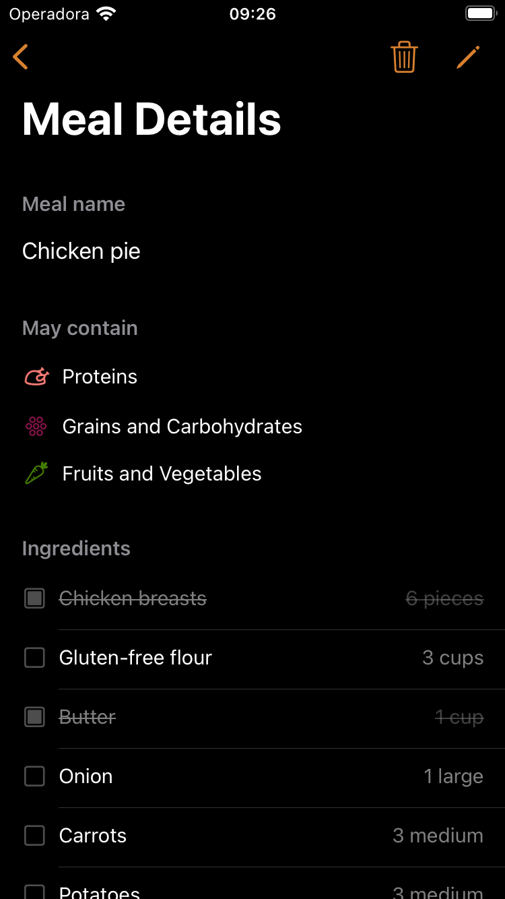 | 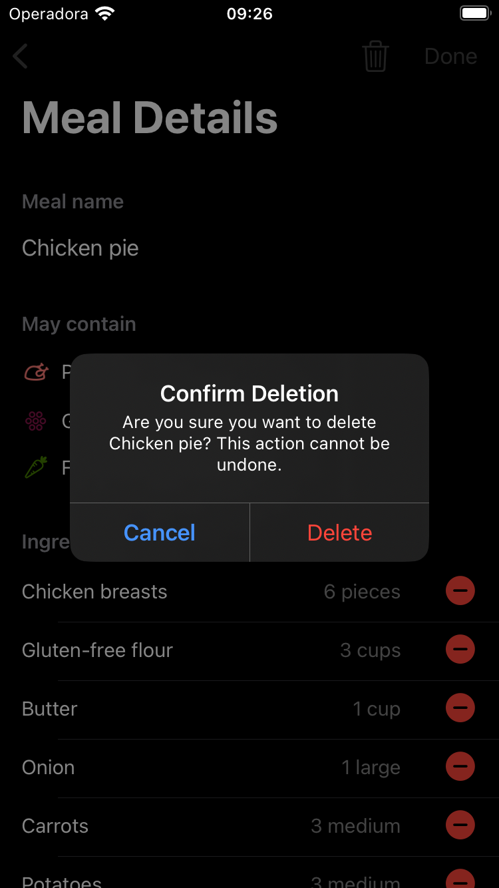 |

### Add a New Shopping List

- A **ScrollView** where users input meal name, portion size, and select measurement units and weekly consumption frequency. The 'Generate' button leads to the ingredient list review view. Alerts are shown for **incomplete fields** or **network/server errors**.

    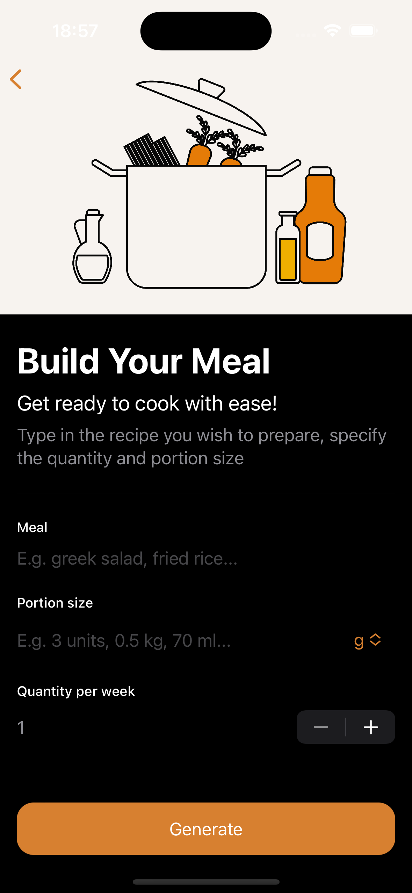

### Shopping List Review

- Displays all ingredients for the selected meal and food categories the meal may contain in a **ScrollView**. Users can confirm the generated list via the 'Confirm selection' button, which then appears in the shopping list view on the home tab in descending order of creation. Users can make changes by clicking 'Make changes'.

    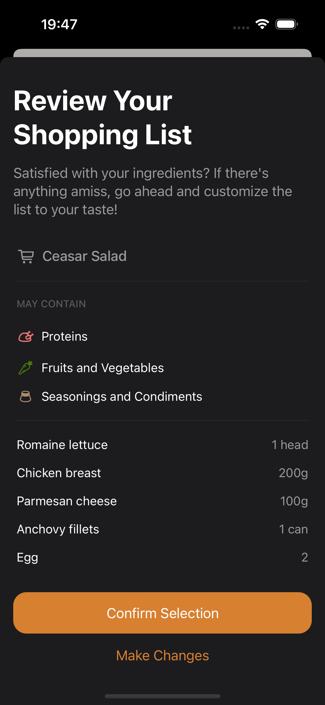

### Launch Screen

Displays the **app name** and an image generated from Midjourney

    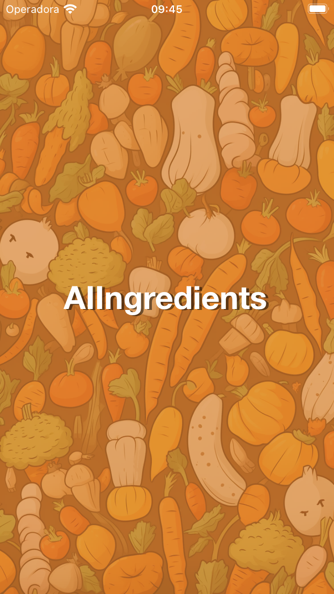

## App Specs

- Modern Concurrency:
    - **Async/await:** keep slow-running tasks(encoding/decoding) off the main thread
    - **MainActor**: update the UI on the main thread
- iOS 16.4
- iPhone only
- **Small screen support (iPhone SE)**
- Swift 5.8
- Xcode 14.3.1
- **Swift Lint**
- Light & Dark Mode
- Landscape & Portrait
- Dynamic Type
- No third-party frameworks
- Custom App Icon
- Applying the HIG
- No warnings

## Architecture

- **MVVM** Pattern
- Vertical folder organization that groups everything related to a feature instead of layered/horizontal separation.
- Notification for observing changes in User Defaults
- **User Defaults** for data persistence
- A centralized place for strings, ensuring lint rules for line length and preparing for Localization
- Uses UITests launch argument to guarantee a deterministic test environment and prevent it from persisting inappropriately and fetching from the actual API.

## Integration with OpenAI API

Uses OpenAI API to generate ingredient lists and categorize meals by user input, including meal name, portion size, weekly quantity and dietary preferences. 

- API Reference: <https://api.openai.com/v1/chat/completions>
- Request body encoding using Encodable
- URL Request includes POST method, request body, and headers
- **URLSession** for data fetching
- Decoding AI-generated JSON responses

## Testing

- Comprehensive **unit tests** covering all app layers, including notifications, persistency, networking, and presentation. Dependency inversion and the Strategy Pattern enabling test doubles.
- Specific scheme for **UI testing** covering the happy path

#### SwiftLint rules desabling reasons

- Suppress `line_length` warnings on Previews
- Suppress `line_length` on tests to assert the actual string messages rather than constant abstractions.
- Suppress `line_length` on tests to assert the actual request JSONs

--- 
credits for the icons
> <a target="_blank" href="https://icons8.com/icon/8nKPPiaJ0gho/thanksgiving">Meat</a> icon by <a target="_blank" href="https://icons8.com">Icons8</a>

> <a target="_blank" href="https://icons8.com/icon/lwK4bEASApAe/milk-bottle">Milk Bottle</a> icon by <a target="_blank" href="https://icons8.com">Icons8</a>